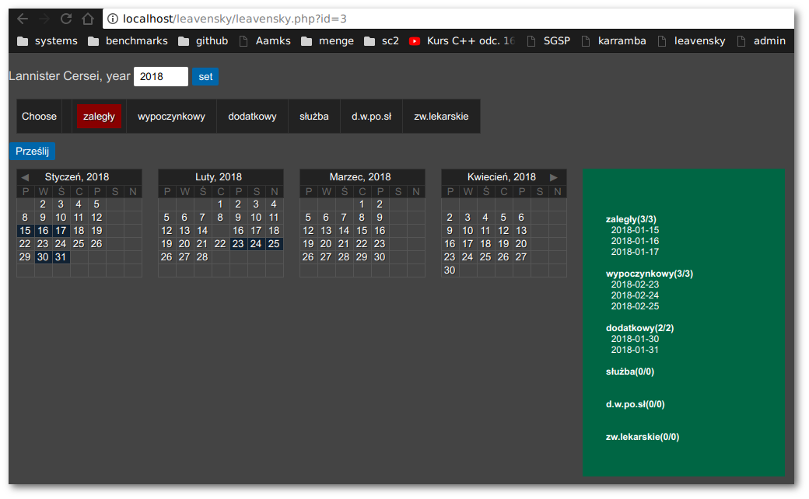
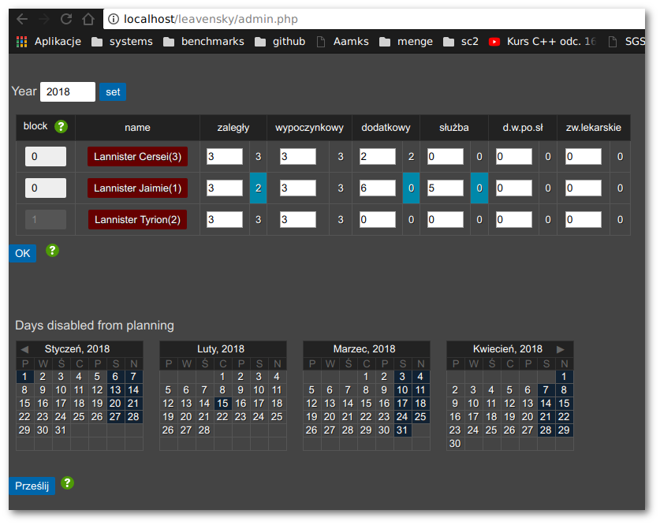

# leavensky

Timeoff/vacation/leave planner. You can define your own set of leave types,
like holidays, overdue, additional, etc. Then you setup limits for each leave type
for each employee. Each employee can pick their leave days by clicking in a
calendar. 
